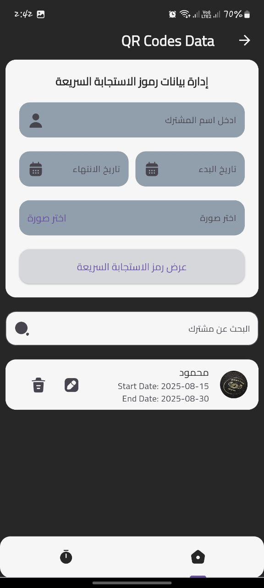
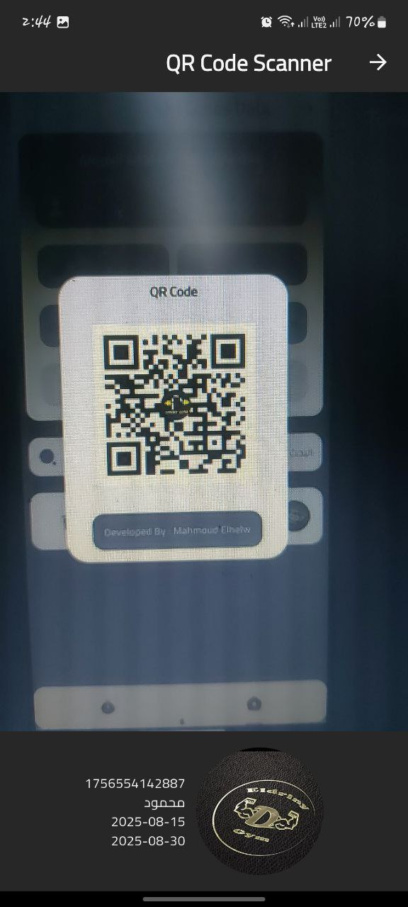

# 🏋️‍♂️ Gym System App

A Flutter-based gym management system with two main modules:
1. **Subscription Management** – Add and manage gym subscribers, and generate a unique QR code for each subscriber.
2. **QR Scanner** – Scan subscriber QR codes at the entrance and instantly display their subscription details.

---

## 📱 Features

### 🔹 Subscription Management
- Add new subscribers with their details.
- Update and manage subscription status.
- Automatically generate a **unique QR code** for each subscriber.

### 🔹 QR Scanner
- Scan QR codes at the gym entrance.
- Validate subscriber identity and subscription status.
- Display subscriber information instantly.

---

## 🛠️ Tech Stack
- **Flutter** – Cross-platform mobile development
- **GetX** – State management & routing
- **Hive / Firebase** – Local or cloud storage.
- **qr_flutter & qr_code_scanner** – QR code generation & scanning

---
## 📱 Screenshots  

  
  
<!--    -->
  
  
<!--    -->
  

---

## 📥 Download APK

Install the app on Android:  
📱 **[Download APK](https://drive.google.com/file/d/1gY2PeXmZEtp3LDe4mjpfy9FfHBroY0Po/view?usp=drive_link)**

---
